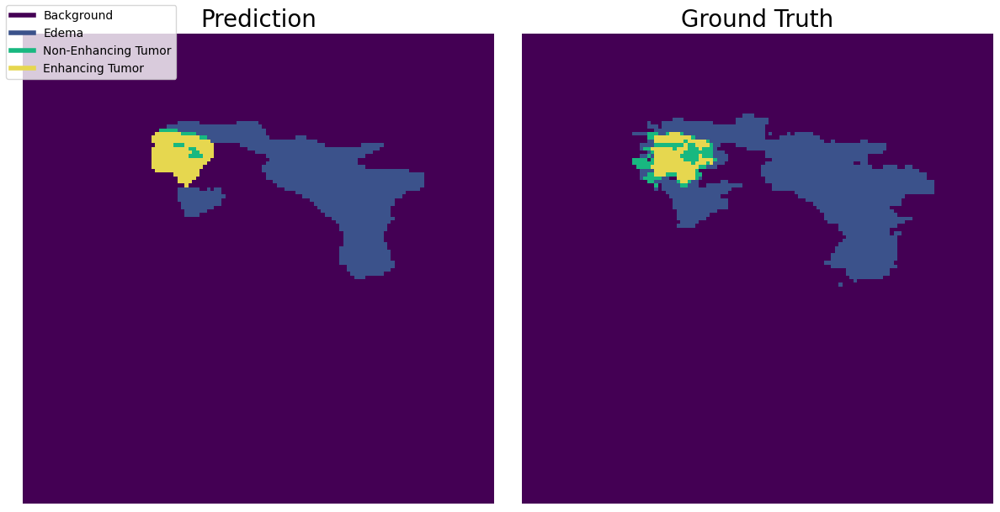
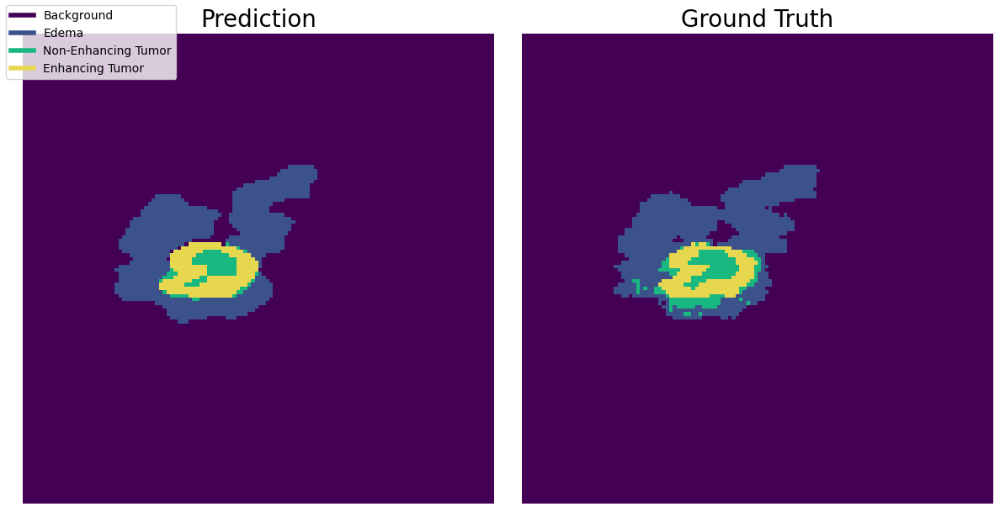

# Model Evaluation

This document presents the evaluation results for our brain tumor segmentation model. The primary focus is on assessing the model's ability to accurately segment different brain tissue types, with an emphasis on tumor detection. Our evaluation criteria include both individual performance metrics for each tissue type and overall metrics that summarize model effectiveness.

## Evaluation Criteria

The model was evaluated based on the following criteria:

1. **Dice Similarity Coefficient (DSC):** Measures the overlap between predicted and actual segmentations for each tissue type.
2. **Mean Dice Score:** Aggregates the Dice scores across all classes to provide an overall performance metric.
3. **Recall:** Focuses on how well the model identifies tumor regions, ensuring no critical regions are missed.
4. **Precision:** Examines how many of the predicted tumor pixels are correct.
5. **Weighted Recall:** Assigns higher importance to critical tumor regions, especially enhancing tumor areas.
6. **Confusion Matrix:** Visualizes the model’s performance across all tissue types to understand misclassification trends.

## Results

### 1. Dice Similarity Coefficient (DSC)

| Tissue Type         | Dice Score |
|---------------------|------------|
| Background          | 99.83%     |
| Edema               | 71.61%     |
| Non-Enhancing Tumor | 53.90%     |
| Enhancing Tumor     | 71.59%     |

### 2. Mean Dice Score

- **Mean DSC:** 74.23%

### 3. Recall

| Tissue Type         | Recall |
|---------------------|--------|
| Edema               | 77.10% |
| Non-Enhancing Tumor | 59.72% |
| Enhancing Tumor     | 75.26% |

### 4. Precision

| Tissue Type         | Precision |
|---------------------|-----------|
| Edema               | 75.52%    |
| Non-Enhancing Tumor | 65.84%    |
| Enhancing Tumor     | 85.28%    |

### 5. Weighted Recall

**Weighted Recall:** 70.97%

### 6. Confusion Matrix

|                  | Background | Edema | Non-Enhancing Tumor | Enhancing Tumor |
|------------------|------------|-------|---------------------|-----------------|
| **Background**   | 121814237  | 167561| 7932                | 5402            |
| **Edema**        | 177595     | 800384| 49879               | 10218           |
| **Non-Enhancing**| 32854      | 73533 | 203543              | 30883           |
| **Enhancing**    | 22348      | 18414 | 47790               | 269395          |

## Visual Results: Predicted vs. Ground Truth Segmentations

To provide a clearer understanding of the model's performance, we present visual examples of its predictions compared to the ground truth.

### Example 1

### Example 2

### Example 3

## Prioritizing Critical Tissue Types

Our evaluation highlights the importance of detecting critical tumor types, especially enhancing tumors. Based on these results:

1. The model performs well in general but requires further fine-tuning for enhancing tumor regions to maximize recall.
2. Despite occasional false positives, the trade-off is acceptable to ensure no critical regions are missed.

## Conclusion

The evaluation results indicate that our model significantly outperformed the baseline model across all metrics, as expected.
